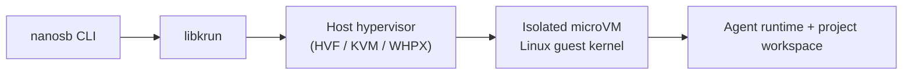

## How a Sandbox Is Built

Nanosandbox uses the same high-level flow on every host OS. The CLI starts a microVM through `libkrun`, the platform hypervisor provides hardware isolation, and a Linux guest kernel runs the workload.

This keeps the isolation boundary consistent while still using each platform's native virtualization backend.

## Workspace Sharing Across Platforms

Your project directory is mounted into the sandbox so the agent can read and edit files directly.

| Platform | Workspace mount | Permissions behavior | Extended attributes | Directory listings |
| --- | --- | --- | --- | --- |
| macOS | virtio-fs | POSIX-style | Supported | Stable |
| Linux | virtio-fs | POSIX-style | Supported | Stable |
| Windows | virtio-fs on NTFS | Linux-like behavior for common workflows | Supported with limits | Stable for day-to-day use |

For most users, this means package installs, builds, tests, and normal project cleanup work the same way across platforms.

## What Is Still Being Tightened on Windows

Windows support is live and practical, but a few advanced edge cases are still being improved:

- Cross-process file locking behaviors in rare tool combinations.
- A small set of low-level read/write hints that only advanced workloads use.
- Some shared-memory mapping patterns used by highly specialized tools.

These do not affect the common local development loop. If you hit one of these cases, start with the troubleshooting guides and share a reproducible example so we can prioritize it.

## Related Reading

- [Linux Is Hardened. Windows Is Live. The Sandbox Runs Everywhere.](/articles/docker-sbx-linux-windows-shipped)
- [How We See Sandboxing Today](/articles/how-we-see-sandboxing-today)
- [Troubleshooting: Common Errors](/docs/troubleshooting/common-errors)
